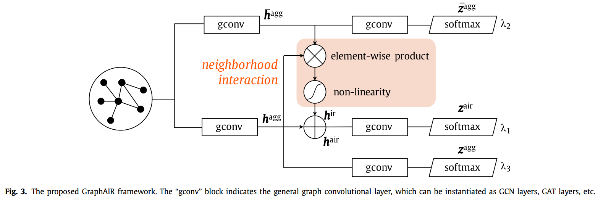

# GraphAIR

## Description
This is the repository for paper [GraphAIR: Graph Representation Learning with Neighborhood Aggregation and Interaction](https://arxiv.org/abs/1911.01731). This paper has been accepted by *Patten Recognition* (Elsevier). 

## Requirements

```bash
conda create -n air python=3.6
conda activate air
pip install -r requirements.txt
```

## Architecture

We prove that existing neighborhood aggregation scheme has difficulty in well capturing complicated non-linearity of graph data. Our work explicitly models neighborhood interaction for better capturing non-linearity of node features.

<div align="center">

</div>


The architecture is illustrated as follows.

<div align="center">

</div>

## Usage

You can conduct node classification experiments on citation network (Cora, Citeseer or Pubmed) using the following commands:

```bash
python train.py --dataset cora --epochs 400 --w1 1.1 --w2 0.5 --w3 0.5
```

```bash
python train.py --dataset citeseer --epochs 3500 --w1 1.1 --w2 0.6 --w3 0.6
```

```bash
python train.py --dataset pubmed --epochs 400 --w1 1.1 --w2 0.9 --w3 0.6
```

## Cite
Please cite our paper if you use this code in your own work:

```
@article{hu2020graphair,
  title={Graphair: Graph representation learning with neighborhood aggregation and interaction},
  author={Hu, Fenyu and Zhu, Yanqiao and Wu, Shu and Huang, Weiran and Wang, Liang and Tan, Tieniu},
  journal={Pattern Recognition},
  pages={107745},
  year={2020},
  publisher={Elsevier}
}
```

## Acknowledgment
The structure of this code is largely based on [GCN](https://github.com/tkipf/gcn) by Kipf.

