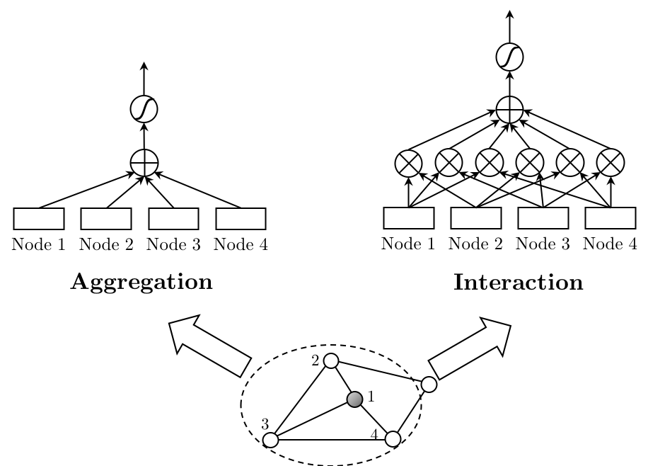

# GraphAIR

## Description
This is the repository for paper [GraphAIR: Graph Representation Learning with Neighborhood Aggregation and Interaction](https://arxiv.org/abs/1911.01731). This paper has been submitted to *Patten Recognition* (Elsevier). 

## Requirements

- Tensorflow (1.9.0)
- networkx

## Architecture

We prove that existing neighborhood aggregation scheme has difficulty in well capturing complicated non-linearity of graph data. Our work explicitly models neighborhood interaction for better capturing non-linearity of node features.



## Usage

You can conduct node classification experiments on citation network (Cora, Citeseer or Pubmed) using the following commands:

```bash
python train.py --dataset cora --epochs 400 --w1 1.1 --w2 0.5 --w3 0.5
```

```bash
python train.py --dataset citeseer --epochs 3500 --w1 1.1 --w2 0.6 --w3 0.6
```

```bash
python train.py --dataset pubmed --epochs 400 --w1 1.1 --w2 0.9 --w3 0.6
```

## Cite
Please cite our paper if you use this code in your own work:

```
@article{GraphAIR19,
    title = {GraphAIR: Graph Representation Learning with Neighborhood Aggregation and Interaction},
    author = {Fenyu Hu and Yanqiao Zhu and Shu Wu and Weiran Huang and Liang Wang and Tieniu Tan},
    journal = {arXiv preprint arXiv:1911.01731},
    year = {2019}
}
```

## Acknowledgment
The structure of this code is largely based on [GCN](https://github.com/tkipf/gcn) by Kipf.

